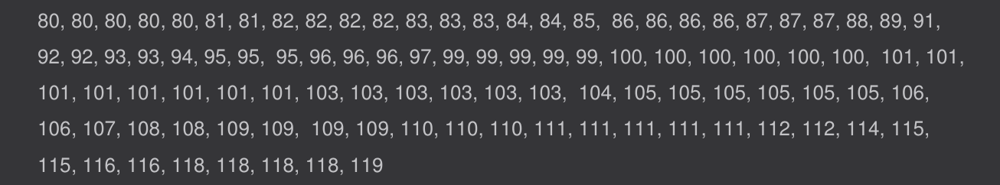
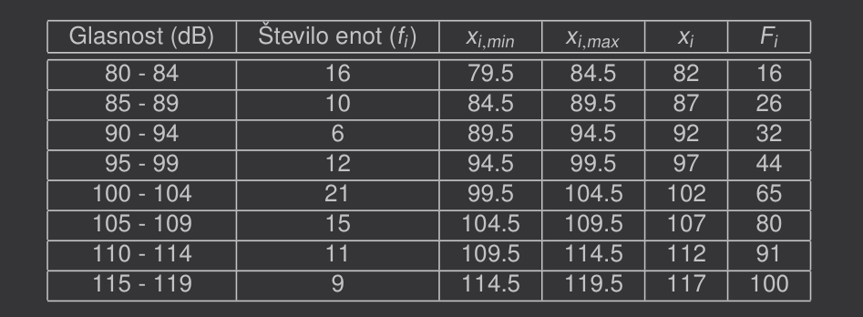
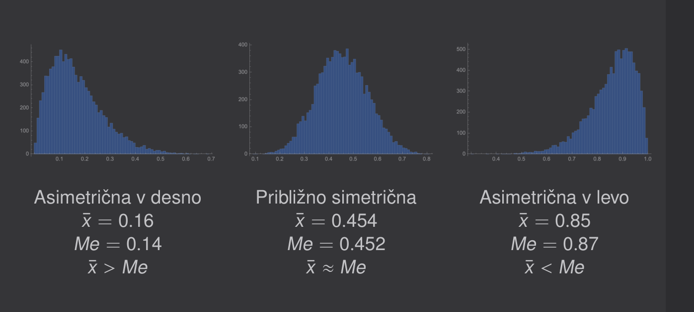

# Mere centralne tendence

Mere centralne tendence oziroma središčnosti so npr. mediana, aritmetična
sredina ali modus (vrednost z najvišjo frekvenco).

Aritmetično sredino lahko določimo le številskim, mediano samo urejenostnim
in modus vsem tem ter opisnim.

---

**Primer:** Izmerjena glasnost (dB) 100 škržatov (podatki v ranžirni vrsti):

 

Aritmetična sredina: 

$$
\bar x = \frac{x_{1} + ... + x_{n}}{n} = 99.01 \ dB
$$

Mediana:

$$
R(Me) = 0.5 \cdot n + 0.5 = 50.5 \Rightarrow Me = 100.5 \ dB
$$

Modus: 

$$
101 \ dB
$$

---

**Primer:** Izmerjena glasnost (dB) 100 škržatov (podatki v frekvenčni tabeli):

 

Aritmetična sredina: 

$$
\bar x = \frac{f_{1}x_{1} + ... + f_{k}x_{k}}{f_{1} + ... + f_{k}} = \frac{f_{1}x_{1} + ... + f_{k}x_{k}}{n}
$$

Mediana: 

$$
x_{0,min} + \frac{F(Me) - F(x_{0,min})}{f_{0}} \cdot d_{0} = 99.5 + \frac{50.5 - 44}{21} \cdot 5 = 101.05 
$$

- $k$ - število razredov
- $n$ - število enot
- $x_{0,min}$ - spodnja meja razreda
- $f_{0}$ - frekvenca
- $d_{0}$ - širina razreda, v katerem leži mediana
- $F(Me) = 0.5 \cdot n + 0.5$

Modusni razred: 

$$
100 - 104 \ dB
$$

 
