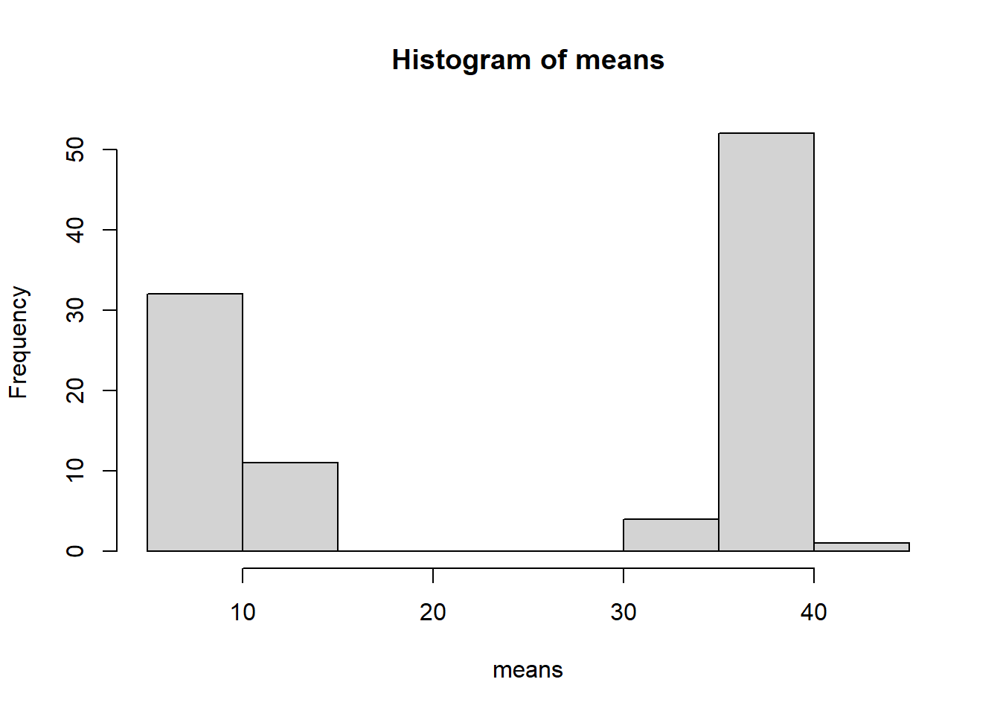
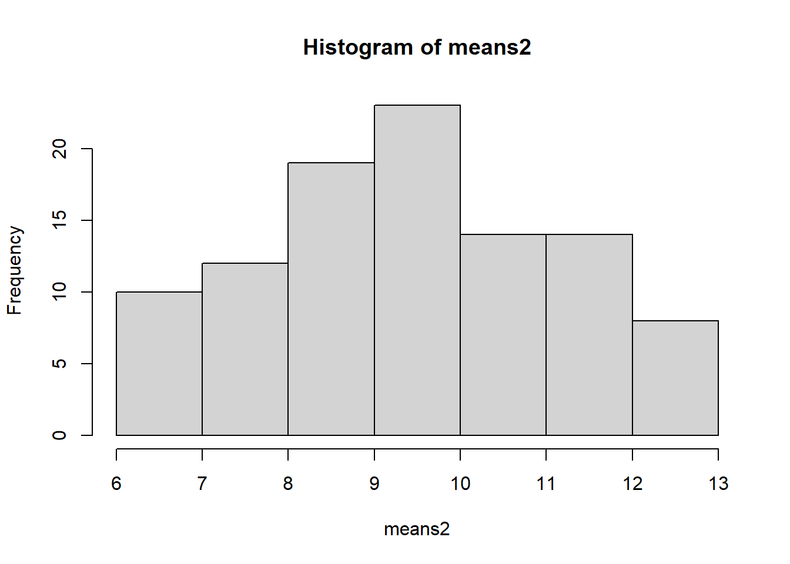
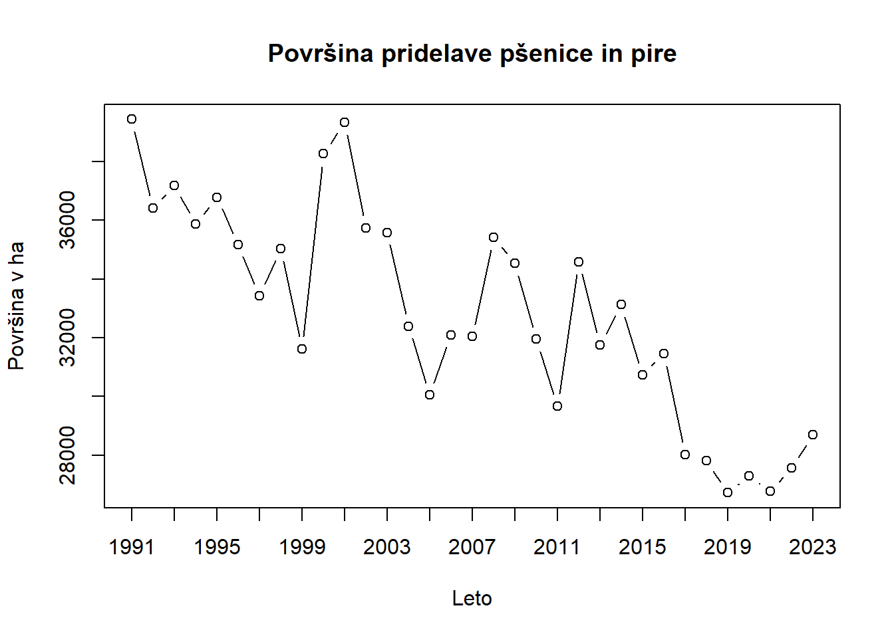
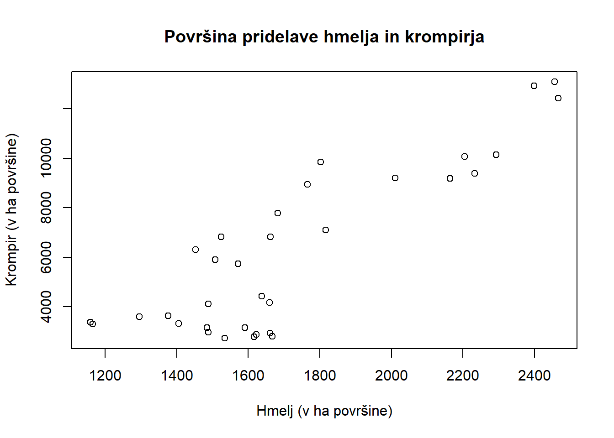

# Temperature converter

Zapišite funkcijo, ki vam bo ob vnosu vrednosti temperature 
v Fahrenheitih vrnila temperaturo v Kelvinih. Formula za 
pretvarjanje K = ((F - 32) * (5/9)) + 273.15


::: {.cell}

```{.r .cell-code}
convert_temp <- \(t_f) {
		((t_f - 32) * (5/9)) + 273.15
}

convert_temp(0)
```

::: {.cell-output .cell-output-stdout}

```
[1] 255.3722
```


:::

```{.r .cell-code}
convert_temp(1)
```

::: {.cell-output .cell-output-stdout}

```
[1] 255.9278
```


:::

```{.r .cell-code}
convert_temp(2)
```

::: {.cell-output .cell-output-stdout}

```
[1] 256.4833
```


:::
:::


# Sample averages

Naj podatki 8,9,5,19,150,7,9,1,13,15 predstavljajo vašo 
populacijo: 


::: {.cell}

```{.r .cell-code}
pop <- c(8,9,5,19,150,7,9,1,13,15)
```
:::


---

1. Izračunajte povprečno vrednost in mediano populacije.


::: {.cell}

```{.r .cell-code}
mean(pop)
```

::: {.cell-output .cell-output-stdout}

```
[1] 23.6
```


:::

```{.r .cell-code}
median(pop)
```

::: {.cell-output .cell-output-stdout}

```
[1] 9
```


:::

```{.r .cell-code}
# ali
quantile(pop, 0.5)
```

::: {.cell-output .cell-output-stdout}

```
50% 
  9 
```


:::
:::


---

2. Izvedite simulacijo, kjer 100 krat ponovite izbiranje 
enostavnega slučajnega vzorca velikosti 5 iz populacije. 
Dobljene podatke zapišite v matriko. Za vsak vzorec 100-ih 
ponovitev izračunajte povprečje in rezultate predstavite v 
histogramu. Iz računjate povprečno vrednost vzorčnega povprečja.


::: {.cell}

```{.r .cell-code}
rows <- 100
cols <- 5

mat <- matrix(0, rows, cols)
means <- rep(0, rows)

for (i in seq(1, rows)) {
		sample <- sample(pop, cols, replace = FALSE)

		mat[i, ] <- sample
		means[i] <- mean(sample)
}

hist(means)
```

::: {.cell-output-display}
{width=672}
:::

```{.r .cell-code}
mean(means)
```

::: {.cell-output .cell-output-stdout}

```
[1] 25.362
```


:::
:::


---

3. Iz populacije izločite vrednost 150. Kaj se zgodi s povprečjem 
in mediano populacije?


::: {.cell}

```{.r .cell-code}
new_pop <- pop[-(which(pop == 150))]

mat2 <- matrix(0, rows, cols)
means2 <- rep(0, rows)

for (i in seq(1, rows)) {
		sample <- sample(new_pop, cols, replace = FALSE)

		mat2[i, ] <- sample
		means2[i] <- mean(sample)
}

hist(means2)
```

::: {.cell-output-display}
{width=672}
:::

```{.r .cell-code}
mean(means2)
```

::: {.cell-output .cell-output-stdout}

```
[1] 9.46
```


:::
:::


# Poljedelstvo

Na spletni strani Statističnega urada Republike Slovenije poiščite podatke 
o površini namenjeni pridelavi poljščin kategorij Pšenica in pira, Ječmen, 
Oves, Koruza za zrnje, Fižol za zrnje, Krompir in Hmelj od leta 1991 do 
leta 2023.

---

1. Podatke očistite in pripravite za uporabo v R-ju. Pripravite .txt datoteko.


::: {.cell}

```{.r .cell-code}
file <- read.delim("C:\\Users\\joene\\Documents\\progAAAAAAA\\statistika\\vaje\\lab-vaje\\vaje-1\\files\\poljscine.txt", row.names = 1)

knitr::kable(head(file))
```

::: {.cell-output-display}


|     | Pšenica.in.pira| Ječmen| Oves| Koruza.za.zrnje| Fižol.za.zrnje| Krompir| Hmelj|
|:----|---------------:|------:|----:|---------------:|--------------:|-------:|-----:|
|1991 |           39433|   7863| 2372|           64229|            556|   13087|  2456|
|1992 |           36413|   8146| 2376|           61220|            574|   12928|  2398|
|1993 |           37173|   9093| 2388|           59253|            559|   12434|  2466|
|1994 |           35876|  12652| 2590|           49359|            481|   10147|  2292|
|1995 |           36779|  12719| 1866|           46750|            594|   10070|  2205|
|1996 |           35159|  12543| 1888|           47123|            595|    9382|  2233|


:::
:::


---

2. Podatke uvozite v R. Podatke za pšenico prikažite grafično.


::: {.cell}

```{.r .cell-code}
plot(file$Pšenica.in.pira, type = "b", xaxt = "n", xlab = "Leto", ylab = "Površina v ha", main = "Površina pridelave pšenice in pire")
axis(1, at = seq(1, 33, 2), labels = seq(1991, 2023, 2))
```

::: {.cell-output-display}
{width=672}
:::
:::


---

3. Izračunajte povprečje površine v hektarjih za vsako poljščino.


::: {.cell}

```{.r .cell-code}
polja_means <- matrix(0, 7, 2)

for (i in 1:7) {
		polja_means[i, 2] = mean(file[, i])
}

polja_means[, 1] <- names(file)

polja_means
```

::: {.cell-output .cell-output-stdout}

```
     [,1]              [,2]              
[1,] "Pšenica.in.pira" "32803.0909090909"
[2,] "Ječmen"          "16123.1212121212"
[3,] "Oves"            "1788.0303030303" 
[4,] "Koruza.za.zrnje" "44044.8484848485"
[5,] "Fižol.za.zrnje"  "436.757575757576"
[6,] "Krompir"         "6217.57575757576"
[7,] "Hmelj"           "1723.12121212121"
```


:::
:::


---

4. Podatke za koruzo razdelite v dve skupini po lastnem kriteriju in izračunajte
povprečno vrednost za vsako skupino.


::: {.cell}

```{.r .cell-code}
koruza <- file$Koruza.za.zrnje
koruza_data <- list(A = koruza[1:10], B = koruza[-(1:10)])

lapply(koruza_data, mean)
```

::: {.cell-output .cell-output-stdout}

```
$A
[1] 51342.7

$B
[1] 40871.87
```


:::
:::


---

5. Grafično predstavite podatke za hmelj in krompir v dveh dimenzijah.


::: {.cell}

```{.r .cell-code}
plot(x = file$Hmelj, y = file$Krompir, xlab = "Hmelj (v ha površine)", ylab = "Krompir (v ha površine)", main = "Površina pridelave hmelja in krompirja")
```

::: {.cell-output-display}
{width=672}
:::
:::

